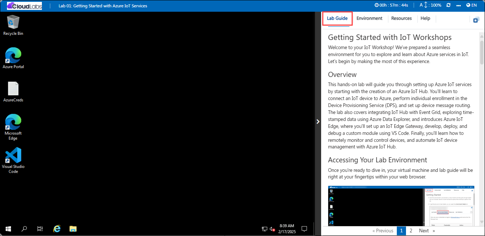
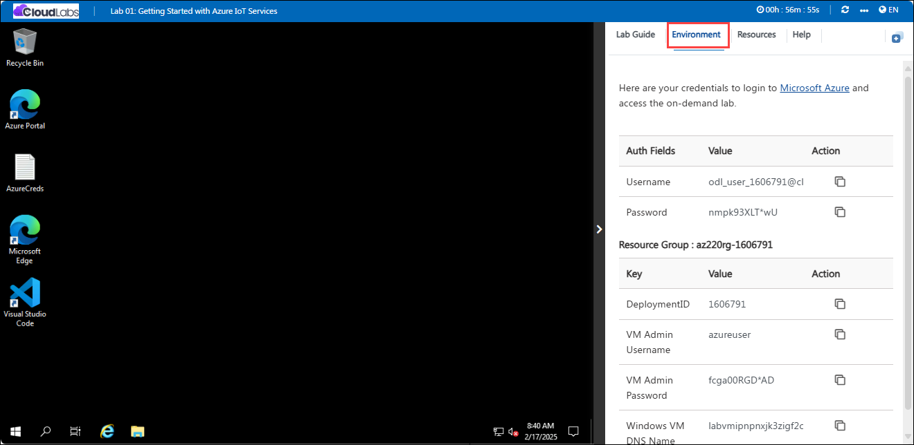
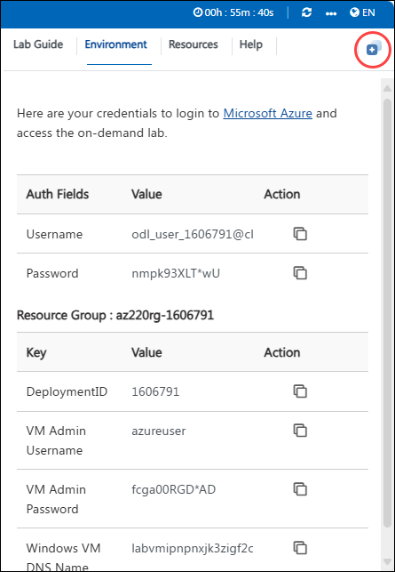
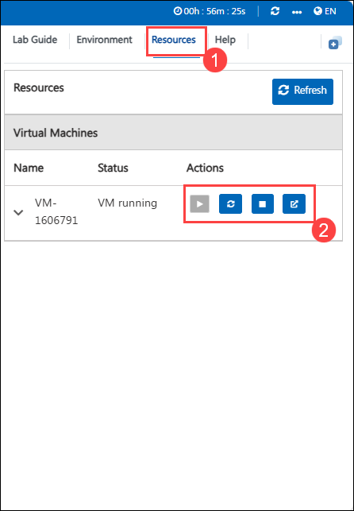

# Getting Started with Your IoT Workshops
 
Welcome to your IoT Workshop! We've prepared a seamless environment for you to explore and learn about Azure services in IoT. Let's begin by making the most of this experience.

## Overview

This hands-on lab will guide you through setting up Azure IoT services by starting with the creation of an Azure IoT Hub. You'll learn to connect an IoT device to Azure, perform individual enrollment in the Device Provisioning Service (DPS), and set up device message routing. The lab also covers integrating IoT Hub with Event Grid, exploring time-stamped data using Azure Data Explorer, and introduces Azure IoT Edge, where you'll set up an IoT Edge Gateway, develop, deploy, and debug a custom module using VS Code. Finally, you'll learn how to remotely monitor and control devices, and automate IoT device management with Azure IoT Hub.

## Accessing Your Lab Environment
 
Once you're ready to dive in, your virtual machine and **Lab Guide** will be right at your fingertips within your web browser.
 
   

### Virtual Machine & Lab Guide
 
In the integrated environment, the lab VM serves as the designated workspace, while the lab guide is accessible on the right side of the screen.

**Note:** Kindly ensure that you are following the instructions carefully to ensure the lab runs smoothly and provides an optimal user experience.

## Lab Guide Zoom In/Zoom Out
 
To adjust the zoom level for the environment page, click the **A↕ : 100%** icon located next to the timer in the lab environment.

   

## Exploring Your Lab Resources
 
To get a better understanding of your lab resources and credentials, navigate to the **Environment** tab.
 
   
 
## Utilizing the Split Window Feature
 
For convenience, you can open the lab guide in a separate window by selecting the **Split Window** button from the top right corner.
 
   
 
## Managing Your Virtual Machine
 
Feel free to **start**, **stop**, or **restart** your virtual machine as needed from the **Resources** tab. Your experience is in your hands!
 
   
 
## Lab Duration Extension

1. To extend the duration of the lab, kindly click the **Hourglass** icon in the top right corner of the lab environment. 

    

    >**Note:** You will get the **Hourglass** icon when 15 minutes are remaining in the lab.

2. Click **OK** to extend your lab duration.
 
     

3. If you have not extended the duration prior to when the lab is about to end, a pop-up will appear, giving you the option to extend. Click **OK** to proceed.

   >**Note:** This extension can be applied twice by the user. If you need additional time, please feel free to reach out to the [Spektra Support Team](labs-support@spektrasystems.com).

## **Lab Guide Zoom In/Zoom Out**
 
To adjust the zoom level for the environment page, click the **A↕ : 100%** icon located next to the timer in the lab environment.

## Let's Get Started with Azure Portal
 
1. On your virtual machine, click on the Azure Portal icon as shown below:
   
 
      .png)
 

2. You'll see the **Sign into Microsoft Azure** tab. Here, enter your credentials:
 
   - **Email/Username:** <inject key="AzureAdUserEmail"></inject>
 
        
 
3. Next, provide your password:
 
   - **Password:** <inject key="AzureAdUserPassword"></inject>
 
       
 
4. If prompted to stay signed in, you can click "No."

 ## Steps to Proceed with MFA Setup if the "Ask Later" Option is Not Visible

1. If you see the pop-up **Stay Signed in?**, click **No**.

1. If **Action required** pop-up window appears, click on **Next**.

   
   

1. On **Start by getting the app** page, click on **Next**.
1. Click on **Next** twice.
1. In **android**, go to the play store and Search for **Microsoft Authenticator** and Tap on **Install**.

   

   > Note: For Ios, Open the app store and repeat the steps.

   > Note: Skip if already installed.

1. Open the app and tap on **Scan a QR code**.

1. Scan the QR code visible on the screen and click on **Next**.

   

1. Enter the digit displayed on the Screen in the Authenticator app on mobile and tap on **Yes**.

1. Once the notification is approved, click on **Next**.

   

1. Click on **Done**.

1. If prompted to stay signed in, you can click **"No"**.

1. Tap on **Finish** in the Mobile Device.

   > NOTE: While logging in again, enter the digits displayed on the screen in the **Authenticator app** and click on Yes.

1. If a **Welcome to Microsoft Azure** pop-up window appears, simply click **"Cancel"** to skip the tour.

1. If you see the pop-up **You have free Azure Advisor recommendations!**, close the window to continue the lab.   

## Support Contact

The CloudLabs support team is available 24/7, 365 days a year, via email and live chat to ensure seamless assistance at any time. We offer dedicated support channels tailored specifically for both learners and instructors, ensuring that all your needs are promptly and efficiently addressed.

Learner Support Contacts:

   - Email Support: labs-support@spektrasystems.com

   - Live Chat Support: https://cloudlabs.ai/labs-support

Click **Next** from the bottom right corner to embark on your Lab journey!
 
   .png)

Now you're all set to explore the powerful world of technology. Feel free to reach out if you have any questions along the way. Enjoy your workshop!

### Happy Learning!!
